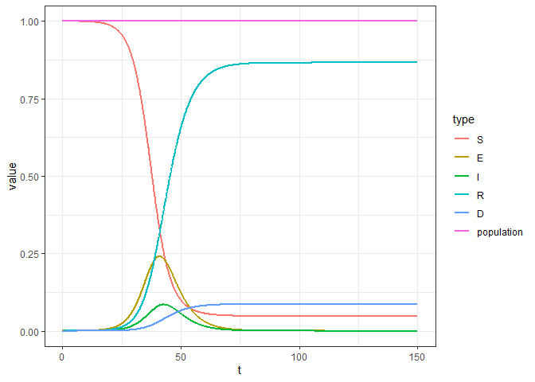
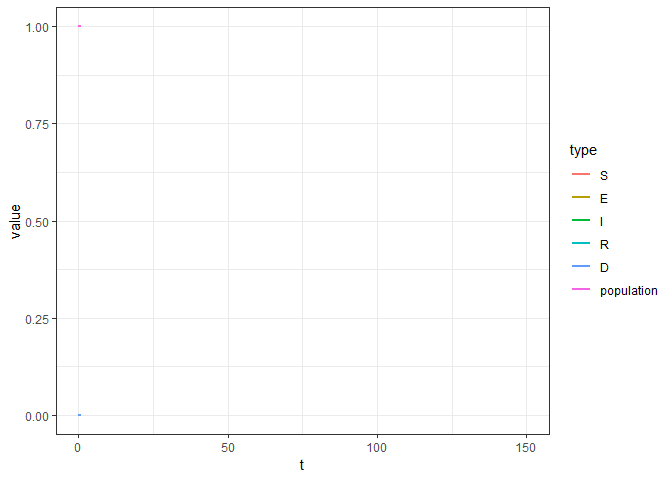
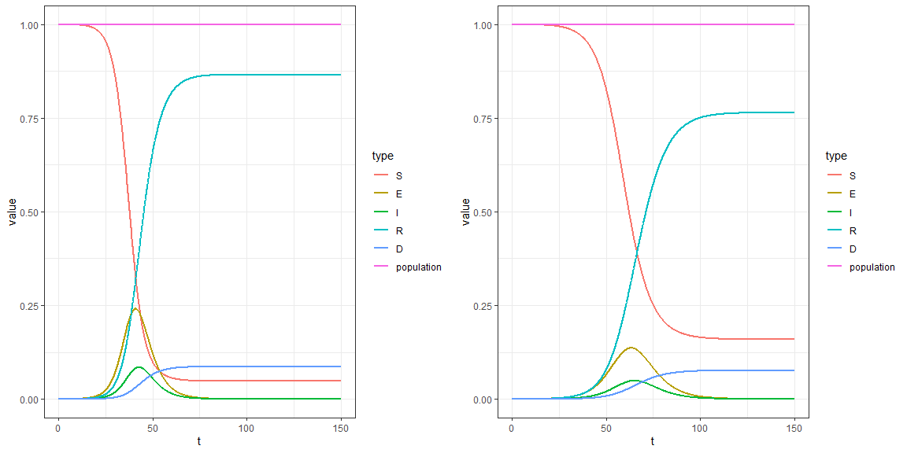

Before we start we need to load some of the packages

### Load some packages:

```r
library(data.table)
library(tidyr)
library(ggplot2); theme_set(theme_bw())
library(gganimate)
library(ggrepel)
library(gridExtra)
```


After this we can start to create our simulation model.

## Create the initial parameters:


```r
#initial parameters

# Number of days
t_max <- 150
# To create 1000 steps? So 10 for each day? To make the curve more smooth?
dt <- 0.1
t <- seq(from = 0, to = t_max, by = dt)


N <- 10000 # population

# Normalized population values
S_0 <- 1-1/N
E_0 <- 1/N
I_0 <- 0
R_0 <- 0
D_0 <- 0
```

## The main function to generate data


```r
create_data <- function(alpha = 0.2, beta = 1.75, gamma = 0.5, rho = 0, dr = 0.05){
  
  #alpha: infection rate (0-1)
  #beta: contact rate (persons)
  #gamma: recovery rate (0-1)
  #rho: social distancing factor (0 everyone, 1 base situation)
  #dr: death rate (0 noone dies)
  
  # Create a data.table with t0 values
  dataSimulation <- data.table(t = t[1], S = S_0, E = E_0, I = I_0, R = R_0, D = D_0)

  for (i in t[2:length(t)]){
    
    #get the latest (which are the last values in our data table) to calculate the next values
    last_S <- dataSimulation[nrow(dataSimulation), S]
    last_E <- dataSimulation[nrow(dataSimulation), E]
    last_I <- dataSimulation[nrow(dataSimulation), I]
    last_R <- dataSimulation[nrow(dataSimulation), R]
    last_D <- dataSimulation[nrow(dataSimulation), D]
    
    # if rho = 0 we dont want to use it in our model
    if(rho == 0){
      
      next_S <- last_S - (beta * last_S * last_I) * dt
      next_E <- last_E + (beta * last_S * last_I - alpha * last_E) * dt
      
    } else {
      
      next_S <- last_S - (rho * beta * last_S * last_I) * dt
      next_E <- last_E + (rho * beta * last_S * last_I - alpha*last_E) * dt
    }
    
    next_I <- last_I + (alpha * last_E - gamma * last_I - dr * last_I) * dt
    next_R <- last_R + (gamma * last_I) * dt
    next_D <- last_D + (dr * last_I) * dt
    
    # create the new row
    newrow <- data.table(t = i, S = next_S, E = next_E, I = next_I, R = next_R, D = next_D)
    
    # insert new row to the datatable
    dataSimulation <- rbindlist(list(dataSimulation, newrow), fill = T)
    
  }
  
  # the population should always add up to 1, so we can check that we did everything all right or not?
  dataSimulation[, population:= S + E + I + R + D]
  
  return(dataSimulation)
  
}
```

## Generate data


```r
dataSimulation <- create_data(alpha = 0.2, beta = 1.75, gamma = 0.5, rho = 0 , dr = 0.05)
```

## Convert the data from wide to long for plotting


```r
longData <- gather(dataSimulation, type, value, S:population, factor_key=TRUE)
setDT(longData)
```

## Create the curves


```r
plot <- ggplot(longData, aes(x = t, y = value)) + geom_line(aes(color = type), size = 1)
plot
```

<!-- -->

## Create the curves using animation


```r
ggplot(longData, aes(x = t, y = value)) +
  geom_line(aes(color = type), size = 1) +
  transition_reveal(t)
```

<!-- -->

### Generate another plot with different parameters


```r
dataSimulation_2 <- create_data(alpha = 0.2, beta = 1.2, gamma = 0.5, rho = 0 , dr = 0.05)
longData_2 <- gather(dataSimulation_2, type, value, S:population, factor_key=TRUE)
```


```r
plot2 <- ggplot(longData_2, aes(x = t, y = value)) + geom_line(aes(color = type), size = 1)
```


```r
grid.arrange(plot, plot2, nrow = 1)
```

<!-- -->


